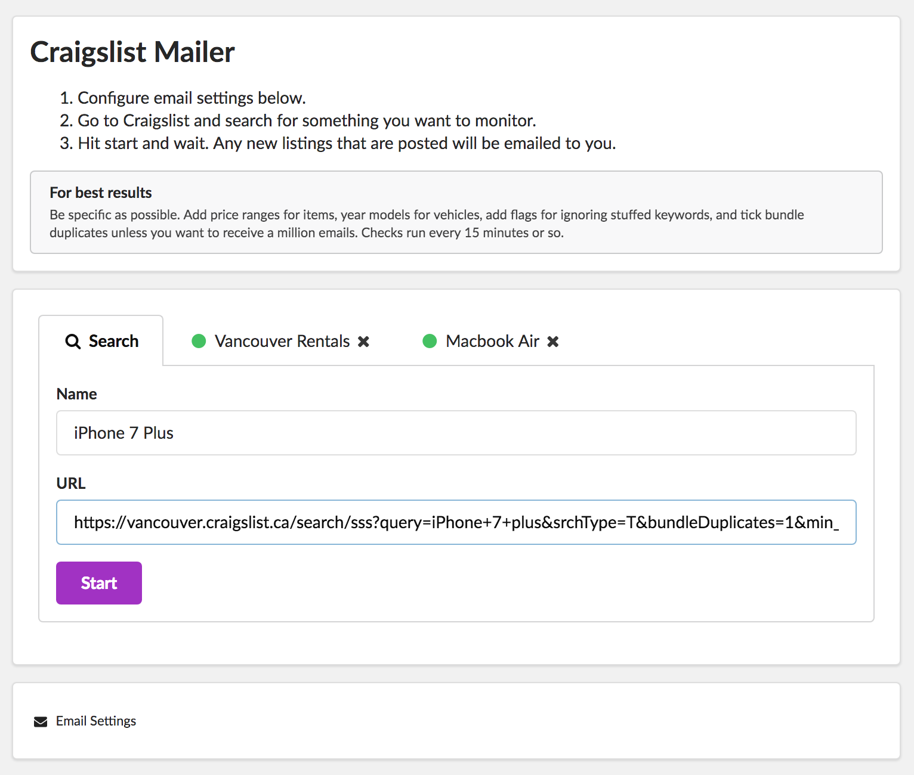

Desktop application that monitors Craigslist and sends out emails when new listings are posted.

Built with Electron, Puppeteer, NodeMailer, & Semantic UI.

### To Use:
1. Clone repo and run `npm install` inside root directory.
2. Run `npm start` to run application locally.

#### To build production application:
1. Run `npm run package-win` for Windows users, `npm run package-mac` for MacOS users, or `npm run package-linux` for Linux users
3. The application will be inside the new 'release-builds' directory.

#### Current Issues:
* Building on Windows and Linux is not working with puppeteer right now for an unknown reason. Mac is fine

